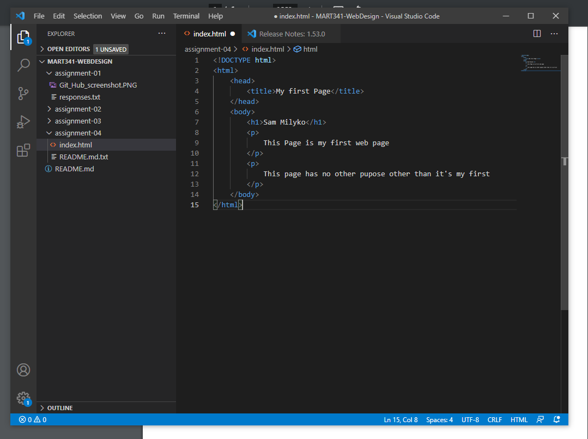

# Sam Milyko
* The basics of a web browser is that it displays information requested by the user, from the web. When you ask for a link, a request goes out to the web and is send back different code (png's, html, ect.) and then formats it in a way visible on the web page.
* Markup language is the text structure of a web page. it "dictates the pages arcitecture" examples are: HTML, HTM, XML, XHTML
* 