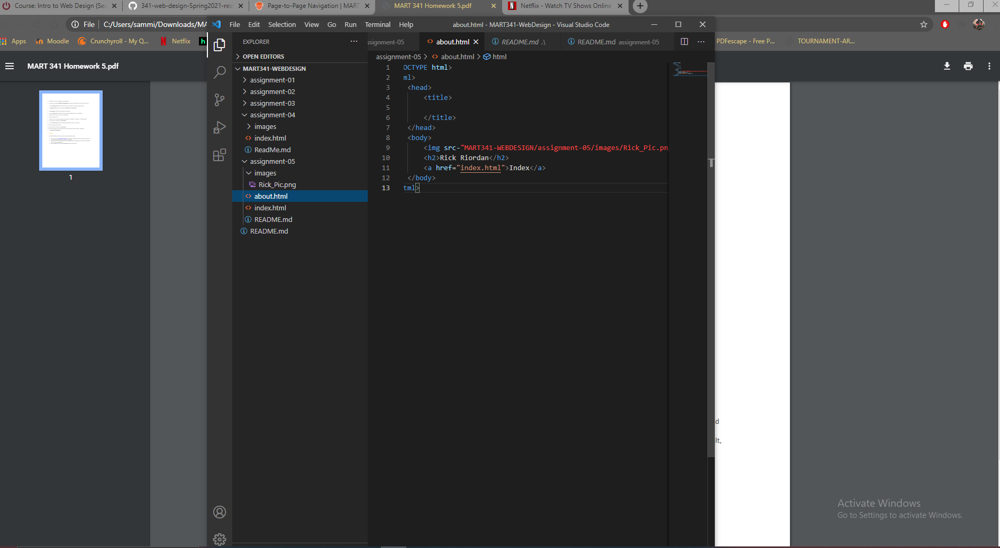

* I decided to take a look at Netflix. it looked extremely old. The buttons were the typical grey popped out click on me buttons. It also was showcaseing the Wii. PS3, and Xbox-360 as platforms to use netflix on. 
* The last few topics are aminly just hard for me to get used to. But that will improve overtime. About over half my friends know coding and/or are computer science majors, so i typically have a lot of help.
* 